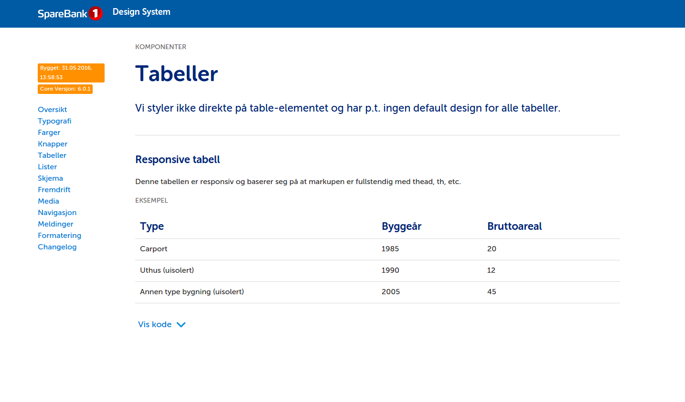
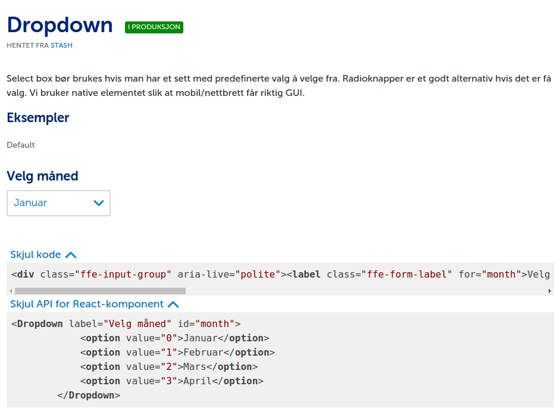
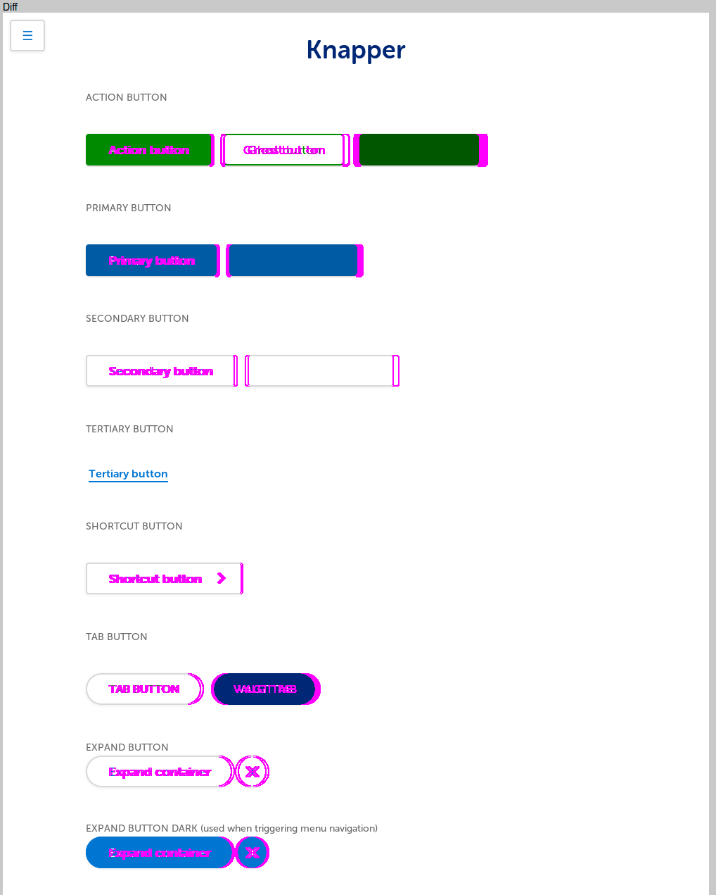
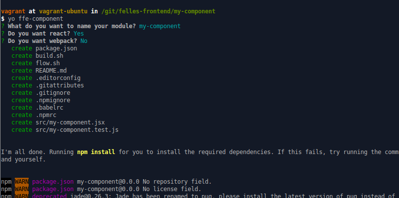
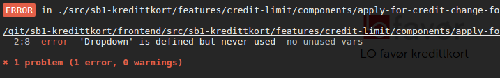
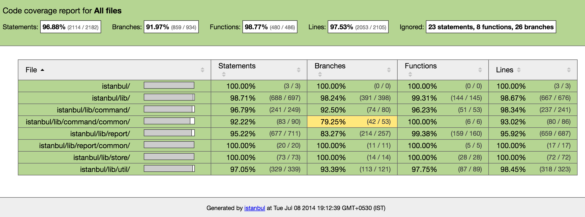
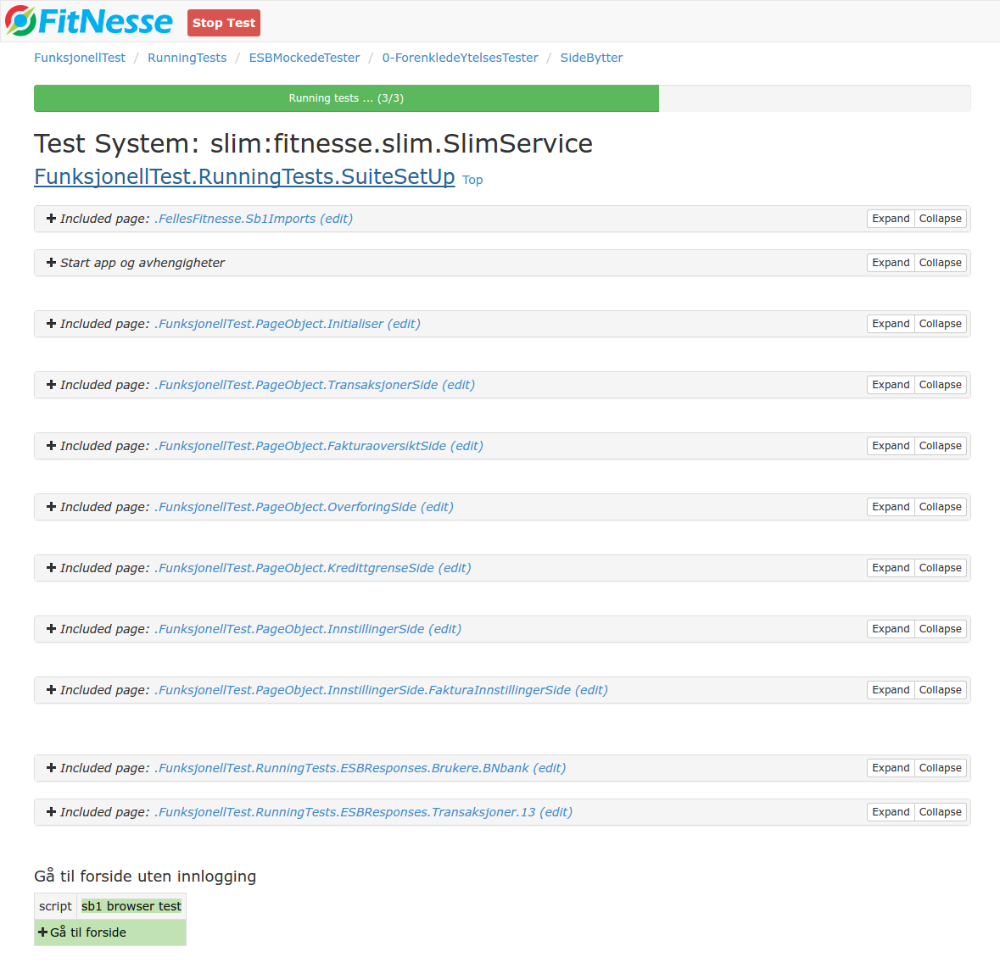

# SpareBank 1

#### An alliance of 16 banks  

\+ Credit cards  
\+ Insurance  
\+ and more...


## A very brief history

#### One of the first Norwegian internet banks

* 199x: First version bought of the shelf <!-- .element: class="fragment" -->
* 2004: Various iterations of a monolith <!-- .element: class="fragment" -->
    * JSP, JSF, Struts, ...
* 2012: Breaking the monolith <!-- .element: class="fragment" -->
    * Microservices & individual apps 


## Organization

#### Inspired by Spotify

* Tribes: Nettbank & Forsikkring <!-- .element: class="fragment" -->
* Guilds: Front-end, UX, UI, ... <!-- .element: class="fragment" -->
* Squads: the dev teams <!-- .element: class="fragment" -->


## Nettbank

* ~100 employees
* ~50 developers <!-- .element: class="fragment" -->
* ~25 apps <!-- .element: class="fragment" -->
* ~8 teams <!-- .element: class="fragment" -->


## Tools

* Nexus - both for `mvn` & `npm`
* Bitbucket Server (Stash)
* Jenkins
* Hipchat
* Vagrant - provisioned dev environment
* Docker, docker, docker
* `bob`


### bob

```
bob feature begin dig-666_a_good_name_for_a_branch
bob docker dnsgen start
bob release cherry-pick 1.2.0
```

https://github.com/jderusse/docker-dns-gen


## Tech

#### Each team is autonomous - each team decides!

**Legacy:** Backbone, Handlebars, Gulp, Angular, ...


## Felles Front-End (FFE)




### Focus on similar look and feel

* UI, UX & UU
* Previously only styling
* Now also react components, such as
    * Buttons, Accordion, Checkbox, Date picker, Dropdown, SVG icons, Radio buttons, Message boxes


### Styling

* Less - *because reasons, that's why*
* BEM

```css
.block__element--modifier {
    ...
}
```


### Example button markup

```html
<button class="ffe-primary-button ffe-primary-button--loading">
  <span class="ffe-primary-button__label">
    <span class="ffe-primary-button__label-text">
      Yolo
    </span>
    <span class="ffe-primary-button__label-spinner">
      Loading...
    </span>
  </span>
</button>
```


### Styleguide

* Automatically generated from the React components
* Node + Webpack + Handlebars





## Visual Regression Testing

Gemini + Firefox running in a Docker container

http://gemini-testing.github.io/gemini/





## Nettbank Front-End (NFE)

Mix of UI elements and other reusable nice to haves

* Error logging
* Fetch/Ajax wrapper & proxies
    * CSRF, error redirect, URL prefixer, ...
*  Session timeout
* i18n mechanism
* Form & validator
* ...


## Kredittkort (KK)

* Shared protypes
* i18n texts
* Forms & other application specific UI elements


## Yeoman




### Keeping it tidy

* EditorConfig
* ESLint config - `eslint-config-ffe`


## Kredittkortsportalen
#### sb1-kredittkort / LO kort

* React
* Redux <!-- .element: class="fragment" -->
* React Router & Redux Router <!-- .element: class="fragment" -->
* Webpack <!-- .element: class="fragment" -->
    * json-loader
	* less-loader
* ImmutableJS <!-- .element: class="fragment" -->


* `npm` as a build runner
* Express (mocked REST endpoints) <!-- .element: class="fragment" -->
    * webpack-hot-middleware
	* redbox-react

 <!-- .element: class="fragment" -->

https://github.com/hedlund/starter-webpack-react <!-- .element: class="fragment" -->


## Forms & validation

Evaluated `redux-forms` and `revalidate`  
I wrote our packages `nfe-form` & `nfe-validator`


Considering `reselect`  
Using homegrown memoization implementations for now


### Be careful of those defaults:

```javascript
const mapStateToProps = state => (
	data: state.getIn(['data', 'that', 'might', 'exist']) || {}
);
```

#### { } !== { }

```javascript
const defaultValues = {};
const mapStateToProps = state => (
	data: state.getIn(['data', 'that', 'might', 'exist'] )|| defaultValues
);
```


## Testing

* Mocha + Chai
* Sinon <!-- .element: class="fragment" -->
* Enzyme <!-- .element: class="fragment" -->
* Istanbul <!-- .element: class="fragment" -->
* Fitnesse <!-- .element: class="fragment" -->


```javascript
import React from 'react';
import { shallow } from 'enzyme';
import sinon from 'sinon';

describe('<MyComponent />', () => {

    it('simulates click events', () => {
        const onButtonClick = sinon.spy();
        const wrapper = shallow(
            <Foo onButtonClick={onButtonClick} />
        );

        wrapper.find('button').simulate('click');
        expect(onButtonClick.calledOnce).to.be.true;
    });
});
```





## Fitnesse

>A simple tool that allows non-technical users to specify and run acceptance tests for software systems.


## Fitnesse

>A horrible tool that prevents technical users from doing anything at all!





```
!include -c . FunksjonellTest.PageObject.TransaksjonerSide

!2 Gaa til forside
!|script|sb1 browser test |
| Gaa til forside         |

!3 Maal trafikk
-!| query: sjekk wiremock soap requests | $WIREMOCK    |
| kall                                  |versjon|antall|
| getCustomer                           | 3     | 1    |
```

```
!***> Gaa til forside
!|scenario        | Gaa til forside               |
|open             | ${HOST}/forside               |
|wait for visible | css=.card-overview            |
|show             | location                      |
|show             | take screenshot | forside.png |
```

https://github.com/fhoeben/hsac-fitnesse-fixtures  
Docker & Wiremock


That's all folks...
